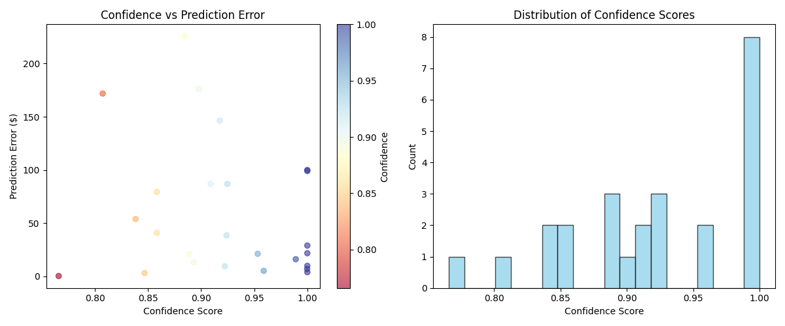

# 🧠 Smart Pricer Fine-Tuner

A specialized system designed to fine-tune a powerful Large Language Model (LLM) into an expert product pricing agent. The model accurately estimates the market price of goods solely on descriptive features, leveraging an enhanced training strategy for superior financial reasoning.


---

## Key Features

The **Smart Pricer** addresses pricing ambiguity through a strategic, data-centric approach:

* **Enhanced Data Preparation:** Cleans raw product descriptions and structures them into the ideal conversational format for LLM training.
* **Multi-Perspective Training:** Data is augmented using distinct System Prompts (e.g., "retail expert," "consumer value") to build a model that considers diverse market factors.
* **OpenAI Fine-Tuning Integration:** Seamlessly handles file uploads, job creation, and status monitoring using the OpenAI API (defaulting to `gpt-4o-mini`).
* **Confidence-Aware Evaluation:** Measures model error rates and confidence levels, allowing for strategic deployment of high-certainty predictions.

---

## Tech Stack

| Technology | Purpose |
| :---: | :---: |
| **Python 3.12** | Core programming language. |
| **OpenAI API** | Fine-tuning job management and model evaluation. |
| **HuggingFace Hub** | Credential management and environment setup. |
| **`uv`** | Fast dependency resolution and virtual environment management. |
| **Data Tools** | `pandas`, `numpy`, `json`, `pickle` for data handling. |

---
### **Confidence vs. Prediction Error**

The model does a final analysis and displays the results after running.
The scatter plot below shows how the fine-tuned model’s confidence scores relate to absolute pricing error.

**Patterns to look for:**

- **High-confidence predictions (≥ 0.95)** tend to cluster around **low error**.  
- **Mid-confidence predictions (0.85–0.92)** show broader variance.  
- **Low-confidence predictions (< 0.82)** correlate with occasional large errors — useful for setting human-review thresholds.

<p align="center">
  
</p>

---

## Getting Started

### Prerequisites

1.  A working installation of **Python 3.12**.
2.  An active **OpenAI API Key** and **Hugging Face Token**.
3.  The necessary data files (`train.pkl` and `test.pkl`) must be present in the root directory.

### Installation & Setup

1.  **Clone the Repository** (If you haven't already done so):
    ```bash
    git clone [https://github.com/lesliejohnson-io/QLoRA.git](https://github.com/lesliejohnson-io/QLoRA.git)
    cd QLoRA
    ```

2.  **Install Dependencies** (Using the efficient `uv` manager):
    ```bash
    uv venv
    source .venv/bin/activate  
    uv pip install -r requirements.txt
    ```

3.  **Setup Credentials**
    Ensure your `OPENAI_API_KEY` and `HF_TOKEN` are correctly set in your local **`.env`** file.

---

## Usage and Commands

The main script is executed using `uv run main.py` with specific flags:

### 1. Prepare Data and Run Demo (Baseline Check)

This command prepares the `.jsonl` files and runs a quick evaluation using the base model to establish a baseline error rate.

```bash
uv run main.py --demo
````

### 2. Start Fine-Tuning Job

This initiates the remote training process on the LLM server.

```bash
# Ensure the fine-tuning call in main.py is uncommented before running
uv run main.py --train-size 500 --val-size 100 
```

### 3. Evaluate Fine-Tuned Model

Once the training job is complete, use the Job ID to test the final model's accuracy:

```bash
uv run main.py --evaluate <PASTE_YOUR_OPENAI_JOB_ID_HERE>
```

```
```
